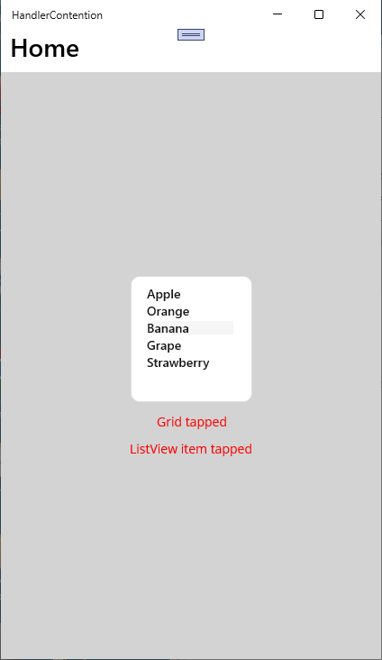
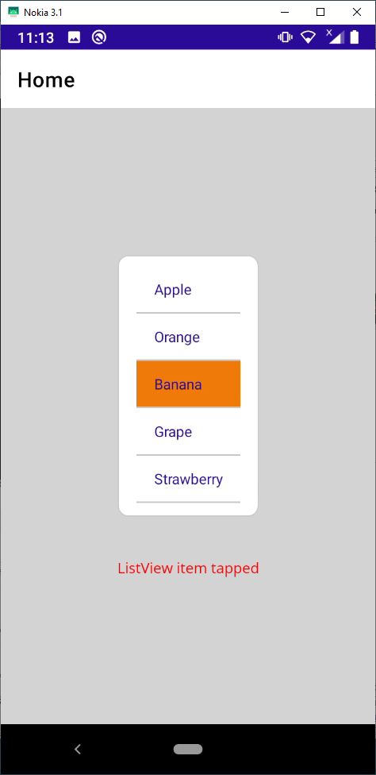
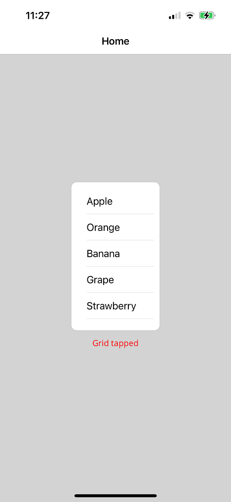

This repository contains a MAUI solution demonstrating how a **ListView.ItemTapped** event is not being raised on iOS when the **ListView** is positioned within a **Grid** that has a **TapGestureRecognizer** attached.

It was created using a standard MAUI app template.  The main page was changed to contain just a **Grid** with a **TapGestureRecognizer**.  A **ListView** with an **ItemTapped** event handler was added along with some labels to show which page events were raised when a ListView item was tapped.

The results were different for the three platforms tested but the issue is that no ListView.ItemTapped event is raised on iOS:

## Windows

## Android

## iOS

